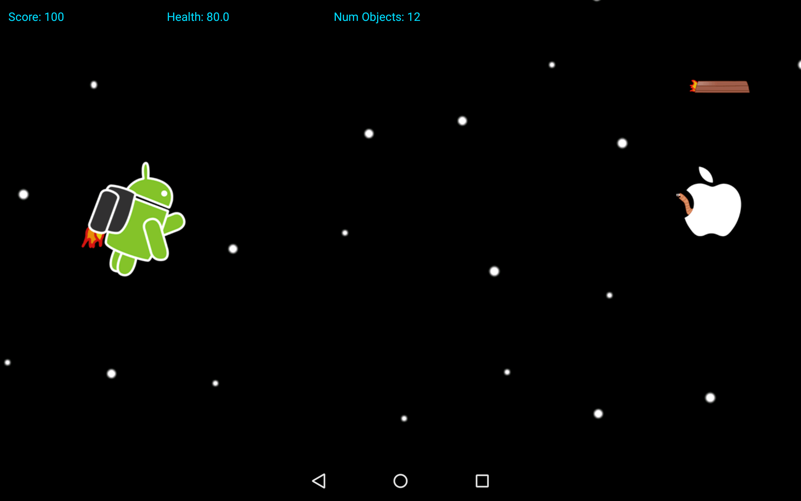

ZED
=======

# About

ZED is a project dedicated to recreating [Ned's Turkey Farm](https://www.youtube.com/watch?v=a_1XbK06YAk) in the Android framework.

Ned's Turkey Farm is a learning tool created by Dr. Ian Parberry to create 2D games, and 
though it is written in C++ using DirectX 9, the same ideas and concepts are carried over
into ZED, with Java and OpenGL. 

# Getting Started
If you need to review Java or are new to learning Android,
check out the [Android tutorials](http://developer.android.com/training/index.html)

If you need to learn OpenGL, I would recommend referencing the [OGL Redbook](http://www.glprogramming.com/red/)
Keep in mind, this code is created for Android devices that can display 
720p. If you wish to target lower devices, you can make changes in the code to do so.

The rendering techniques and other code is derived, inspired, and used from the open source project
[Replica Island](https://code.google.com/p/replicaisland/), which is covered and talked more about in this [Google I/O 2009 video](http://www.youtube.com/watch?feature=player_detailpage&v=U4Bk5rmIpic) and the redux in [Google I/O 2009 video](http://www.youtube.com/watch?feature=player_detailpage&v=7-62tRHLcHk)

License
--------

    Copyright 2010 The Android Open Source Project 
    Copyright 2016 John Carlson

    Licensed under the Apache License, Version 2.0 (the "License");
    you may not use this file except in compliance with the License.
    You may obtain a copy of the License at

       http://www.apache.org/licenses/LICENSE-2.0

    Unless required by applicable law or agreed to in writing, software
    distributed under the License is distributed on an "AS IS" BASIS,
    WITHOUT WARRANTIES OR CONDITIONS OF ANY KIND, either express or implied.
    See the License for the specific language governing permissions and
    limitations under the License.
